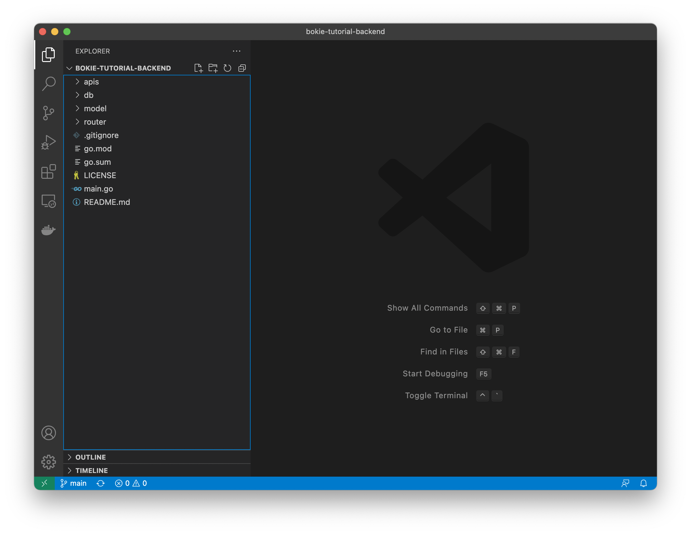
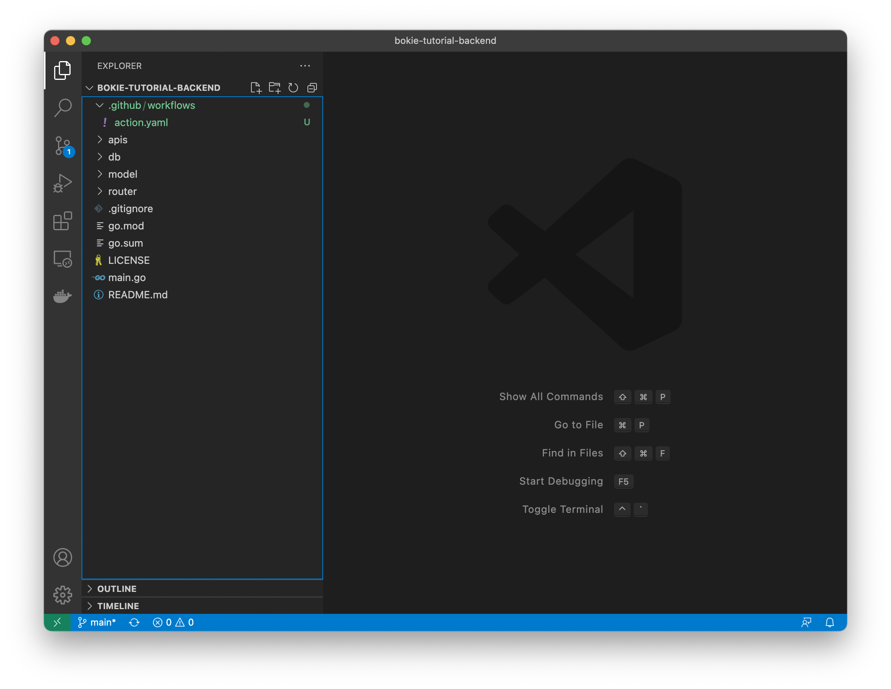

# Structure Actions in Repository

## workflow run in

```
.github/workflows/
```



Steps

- create directory in root project name ```.github```

    ```bash
    mkdir .github
    ```
- in ```.github``` directory create directory name is ```workflows```

    ```bash
    cd .github
    mkdir workflows
    ```

- in .github/workflows will contain action.yaml

    ```bash
    touch action.yaml
    ```

result focus at highlight green color
