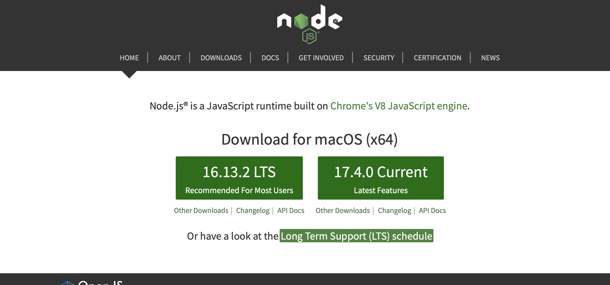
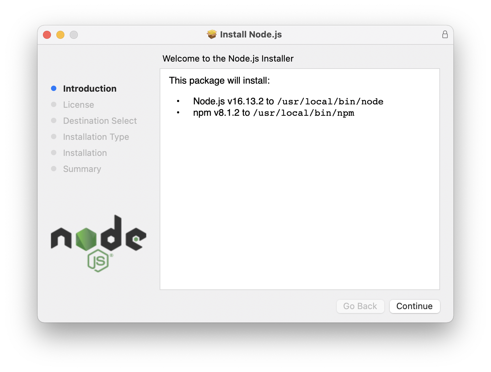
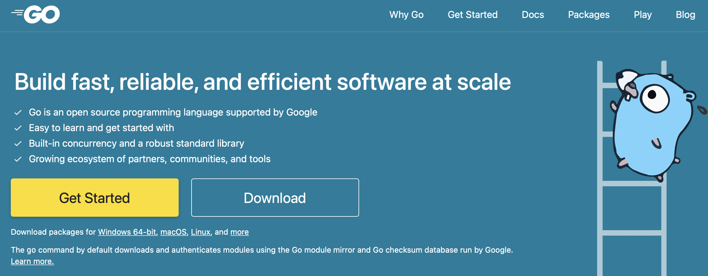

# Install SDK Applications

- Golang
- NodeJS
- Java
- Python


## NodeJS (VueJS, VueX , Angular , Node Projects)

- go to https://nodejs.org select to download node version x.x.x LTS






check env path for execute node and npm it.

default Node.js path

```bash
/usr/local/bin/node
```

default npm path

```bash
/usr/local/bin/npm
```


how to [set system env path for macOS](../others/set-env-path-macOS.md)


# Golang

go to https://go.dev select to download (depend on OS)


