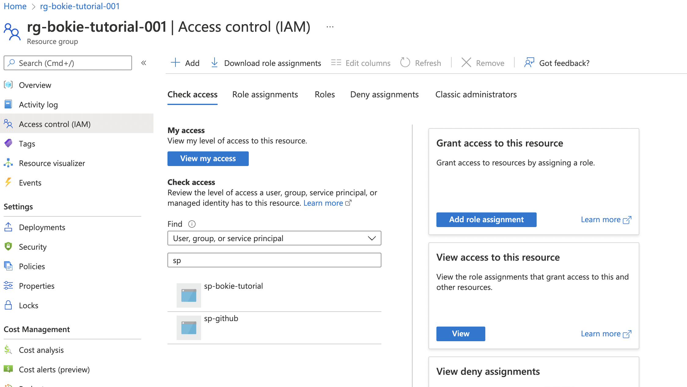
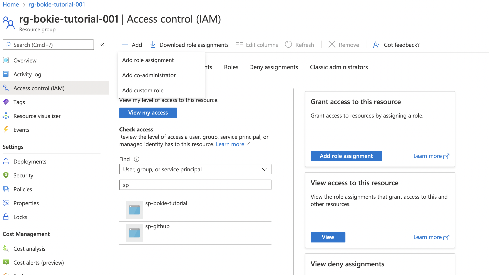
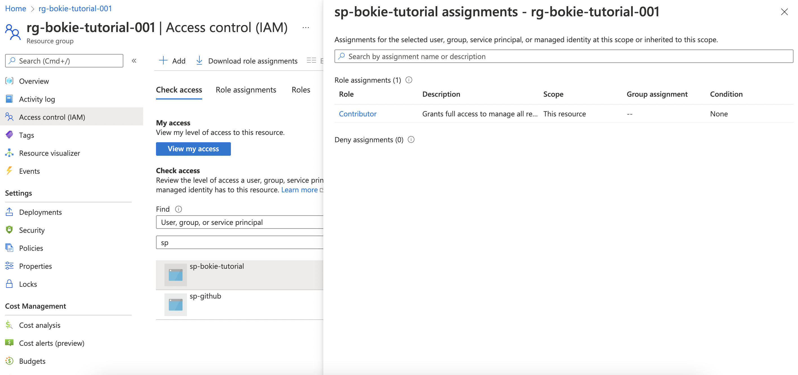

# Join Azure AD in Resource group

in resource group go to left tab Access Control (IAM)

then click + Add and Add role assignment

in this page Add role assignment select role Contribitor

in Memebers Tab

- selected role: Contributor
- Assign access to: User, group, or service principle
- Members : click + Select member
    - search [service principle](../cloud-resources/create-sp.md) name when created then click Select

check permission again in Check access and searching to name it

