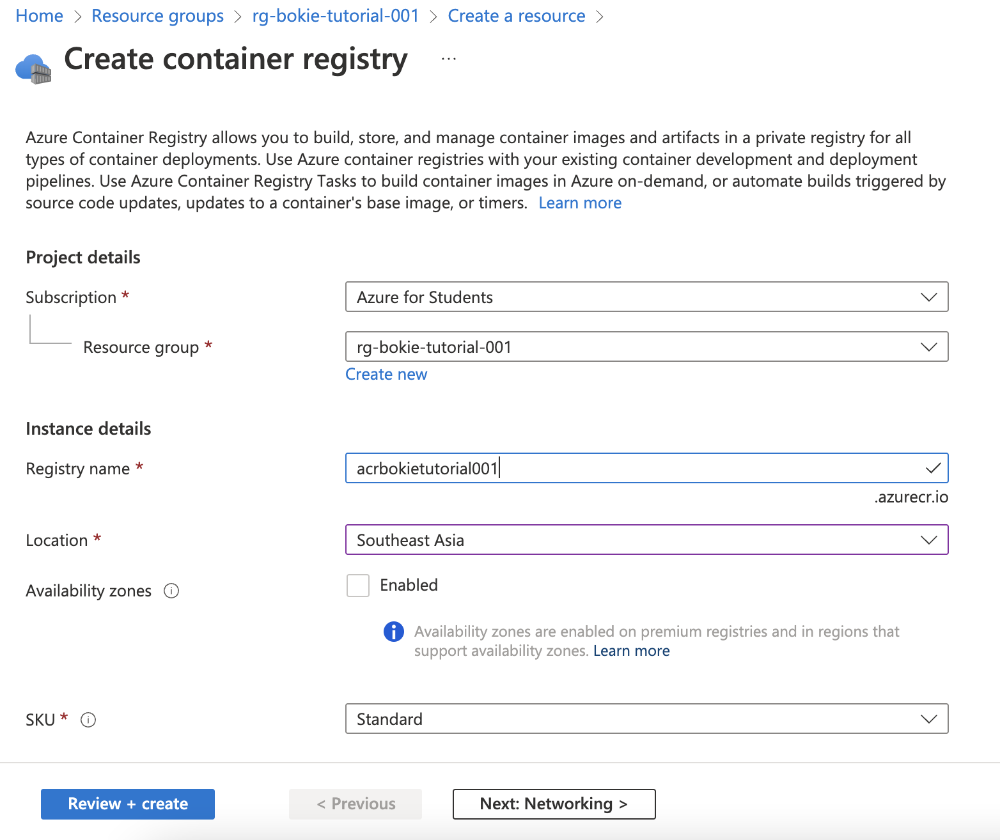
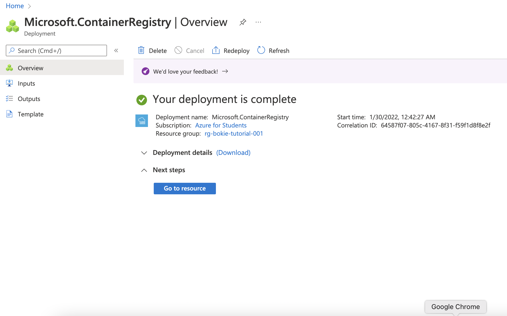
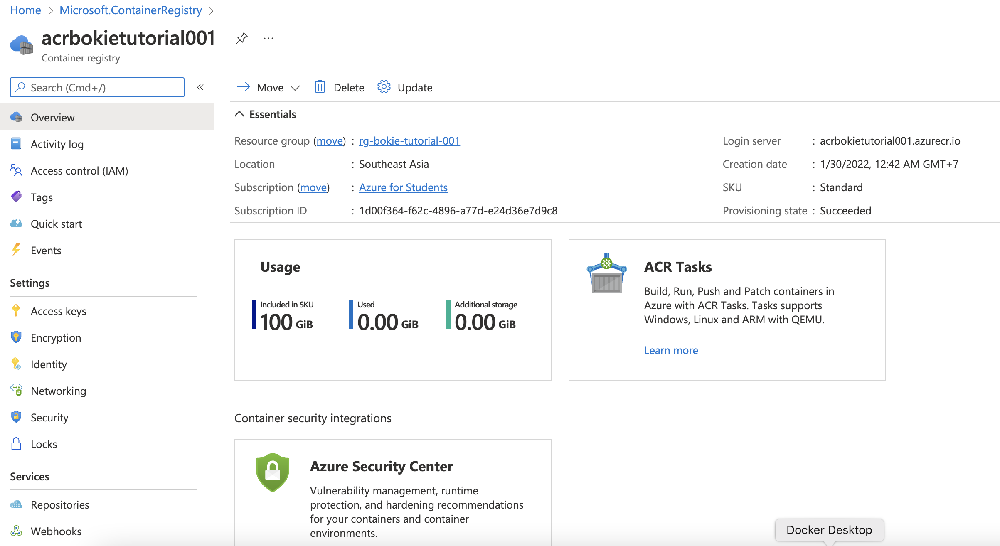
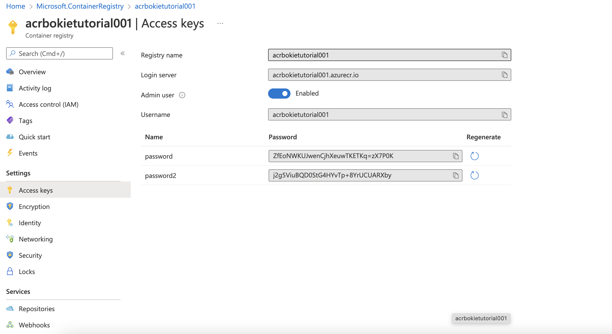
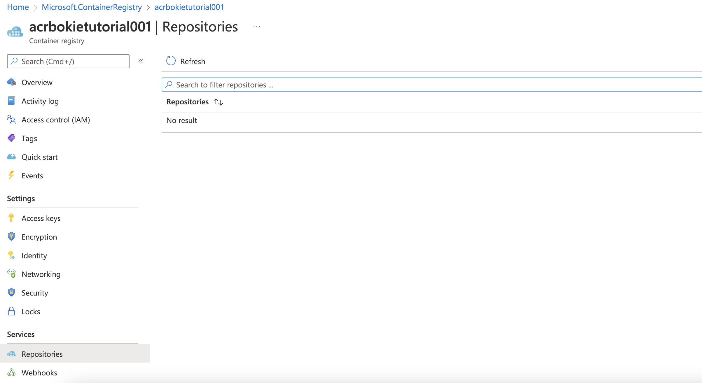

# Create Container Registry

- Go to Create Resouce

- Select Resource for Container Registry
- Create container registry
  - Project details
    - Resource Group : rg-[name]-tutorial-001
    - Instance details
      - Registry name : acr[name]tutorial001
      - Location : Southeast Asia
  - Review + create

Create

Deployment 

Overview 

## Access Key

- Admin user : Enabled

## Image Repository

