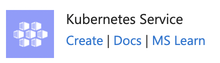
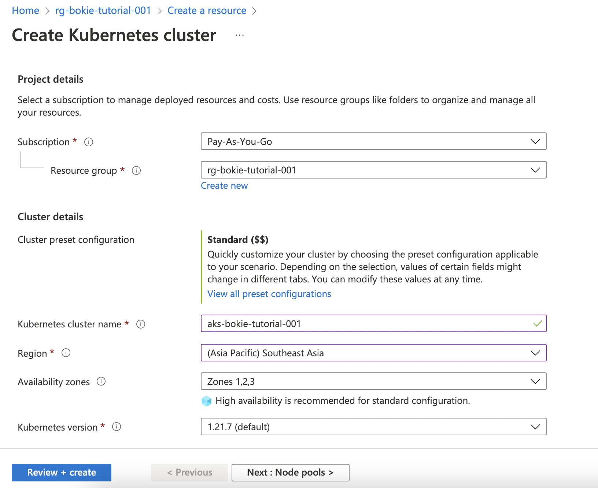
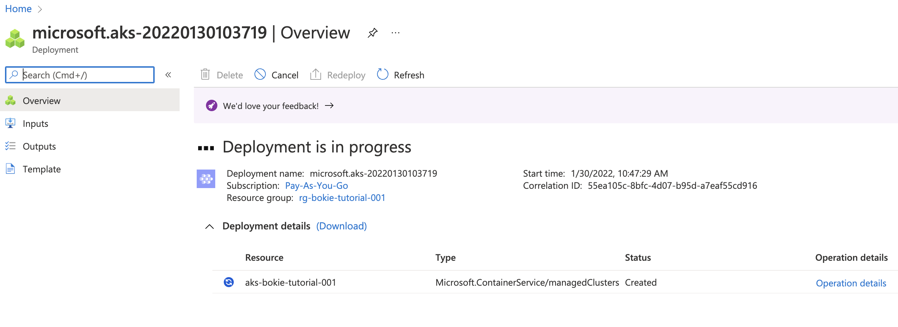
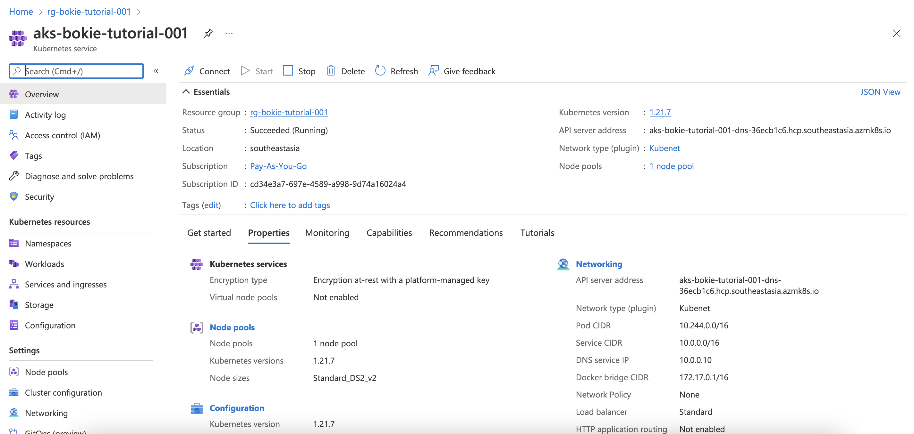

# Create Kubernetes Service

- Go to Create Resouce

- Find resource then select Kubernetes Service
- Create Kubernetes cluster
  - Basic
    - Project details
      - Resource Group : rg-[name]-tutorial-001
      - Cluster details
        - Kubernetes cluster name
   : aks-[name]-tutorial-001
        - Location : South
      - Node pools
        - agentpool
      - Authenication
        - Cluster infrastructure
          - Authentication method : Service principal [create service principle](create-sp.md)
          - Service principal client ID : xxxxxxxxxxx
          - Service principal client secret : xxxxxxxxxx
        - Networking
          - Network configuration: Kubenet
          - DNS name prefix : aks-[name]-tutorial-001-dns
          - Traffic routing
            - Enable HTTP application routing : Enable (when debug dns)
        - Integrations
          - Container monitoring : Disabled
  - Review + create

Create

Deployment 

Overview 

