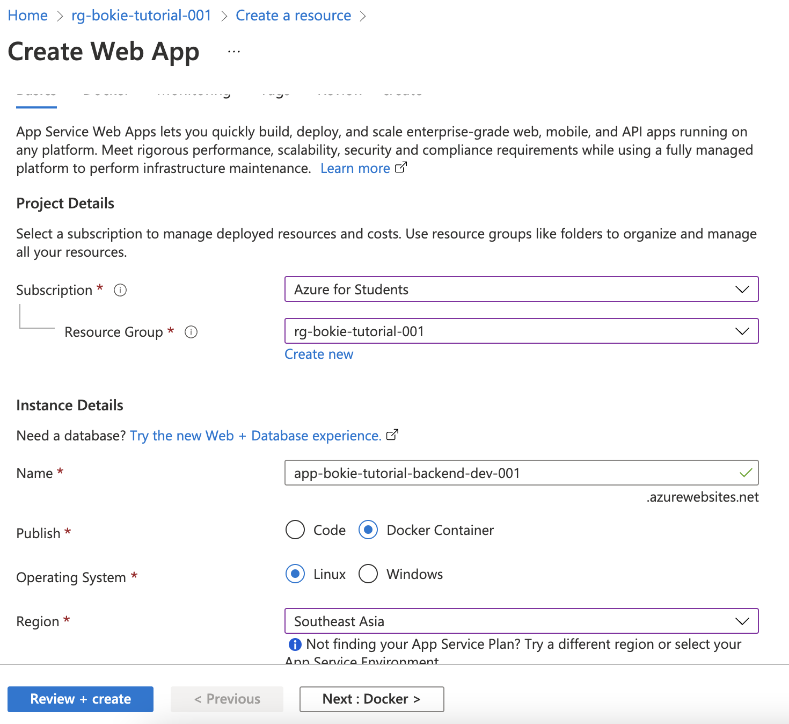
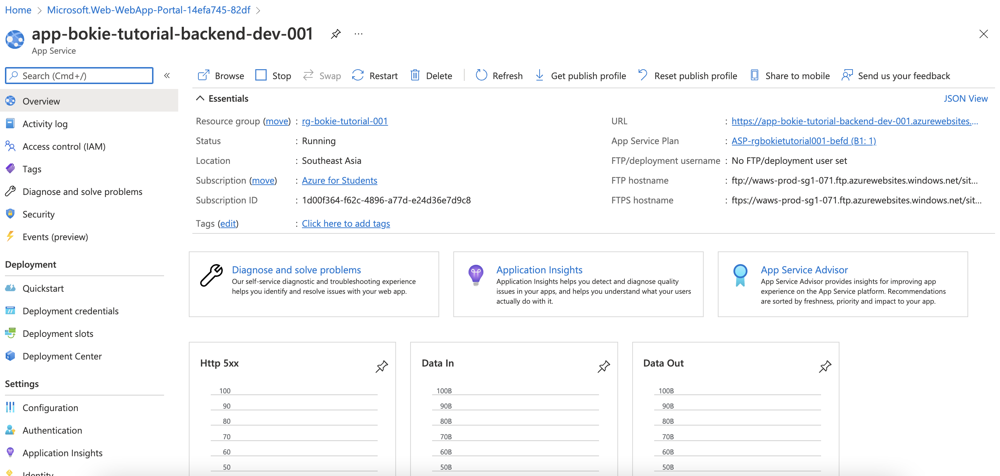
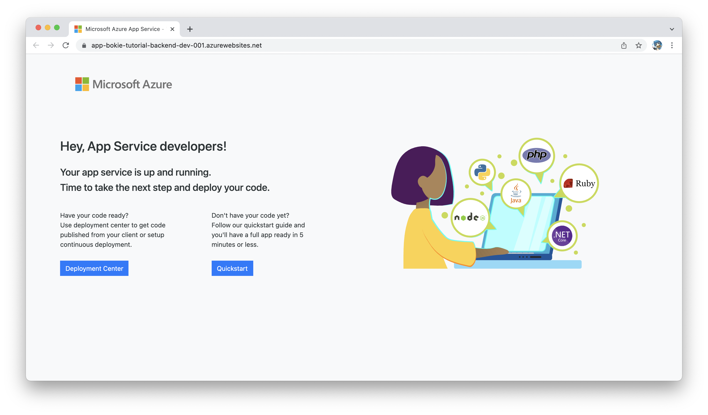

# Create App Service (for Container)

- Go to Create Resouce

- Select Resouce for create (Web App)
- Create Web App
  - Detail
    - Resource Group : rg-[name]-tutorial-001
    - Name : app-[name]-tutorial-backend-dev-001
    - Publish : Docker Container
  - App Service Plan (New) : Default
  - Review + create

Create

Deployment 

Overview 

Try to Browse

