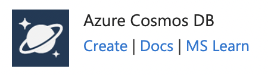
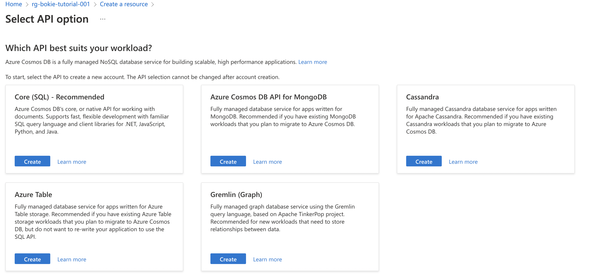
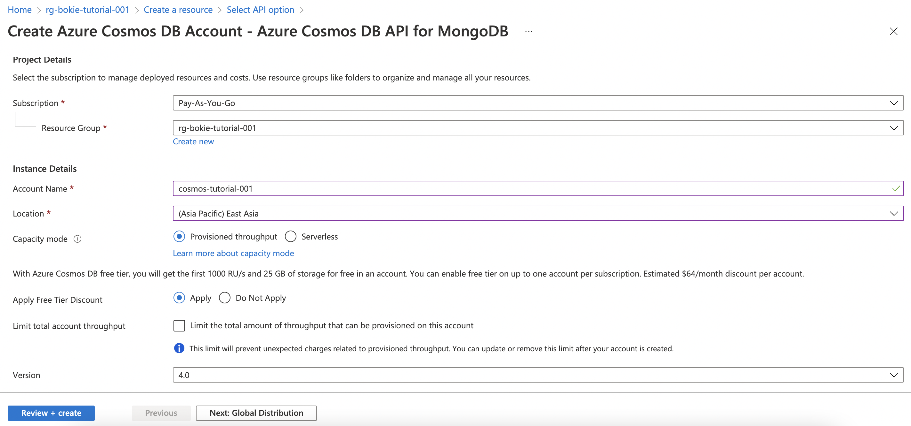
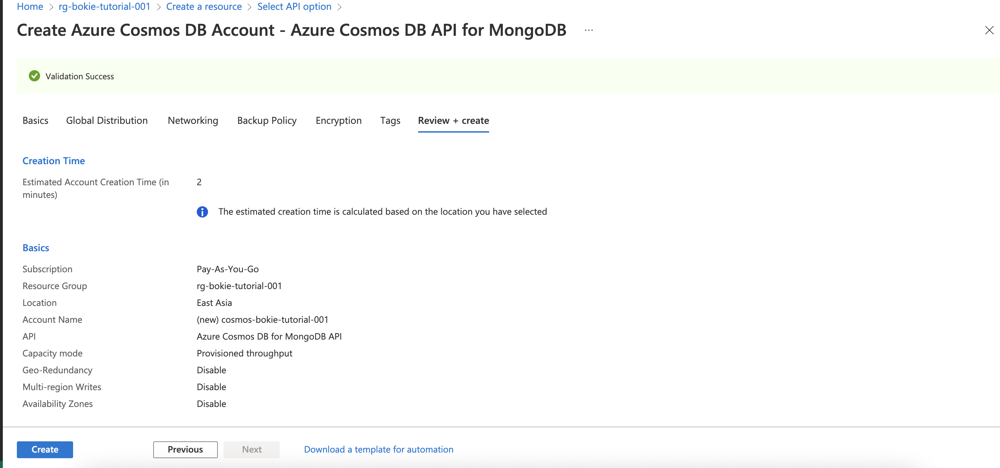
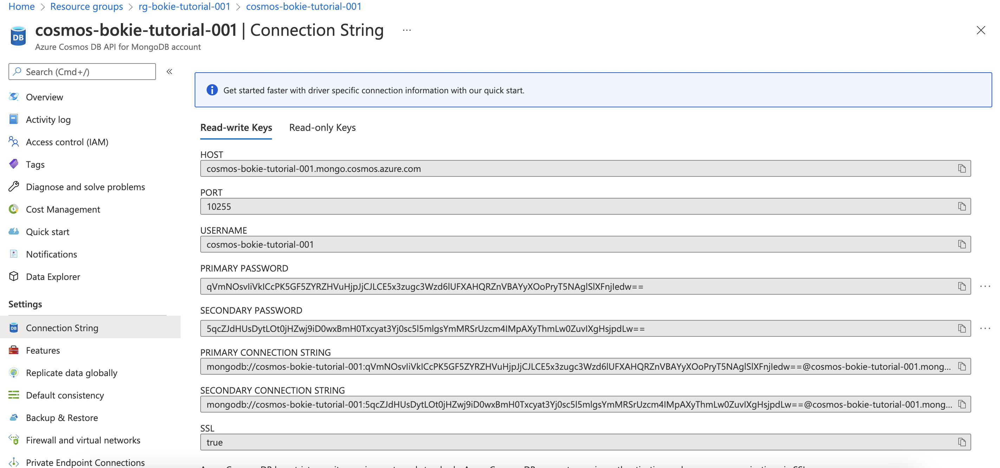

# Create Azure Cosmos DB API for MongoDB

- Go to Create Resouce

- Select Resouce for Azure Cosmos DB
- Select API Option
  - Azure Cosmos DB for MongoDB : Create

- Create Azure CosmosDB Account - Azure Cosmos DB API for MongoDB
  - Basic
    - Resource Group : rg-[name]-tutorial-001
    - Location : East Asia
  
    - Account name : cosmos-bokie-tutorial-001
  - Backup Policy 
    - Backup storage redundancy : Locally-redundant backup storage
  - Review + create
Backup Policy

Create

Review & Create

**Settings**
- Connection String

