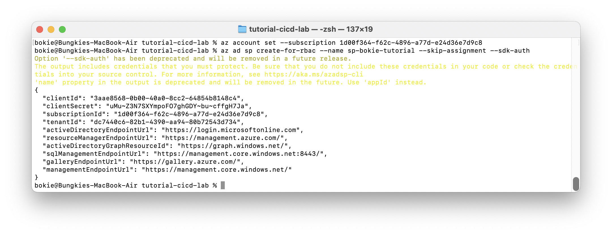

# Create Service Principle Support SDK


## Prerequisites

Install Azure CLI
- [Install Azure CLI on Windows](https://docs.microsoft.com/en-us/cli/azure/install-azure-cli-windows?tabs=azure-cli)
- [Install Azure CLI on macOS](https://docs.microsoft.com/en-us/cli/azure/install-azure-cli-macos) with [Homebrew](https://brew.sh)

more detail at https://docs.microsoft.com/en-us/cli/azure

## Create Service Principle

open terminal or cmd

- login with cli

  ```bash
  az login
  ```

- switch subscription
  
  ```bash
  az account set --subscription 1d00f364-f62c-4896-a77d-e24d36e7d9c8
  ```
  
- create SP with SDK Tool
  
  ```bash
  az ad sp create-for-rbac --name sp-bokie-tutorial --skip-assignment --sdk-auth
  ```

will return code format json



copy 4 lines and save credential serect

```json
{"clientId": "?????-?????-????-????-?????????",
  "clientSecret": "???????????????????????",
  "subscriptionId": "?????-?????-????-????-?????????",
  "tenantId": "?????-?????-????-????-?????????"}
```