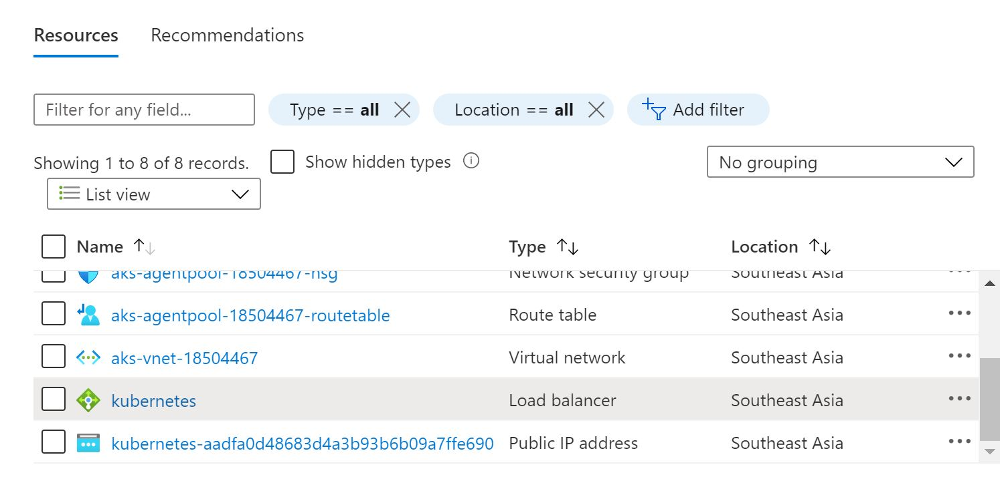

# Describe Kubernetes Service

when created Kubernetes Service will be autoamatic creaed resource group name is : 
**MC_rg-[resource group name]-tutorial-az-asse-dev-001_aks-tutorial-az-asse-dev-001_southeastasia** for suport AKS in resource group has follow below

## Auto created resources

- Virtual machine scale set
- Load balancer
- Network security group
- Public IP address
- DNS
- Virtual network
- Route table

