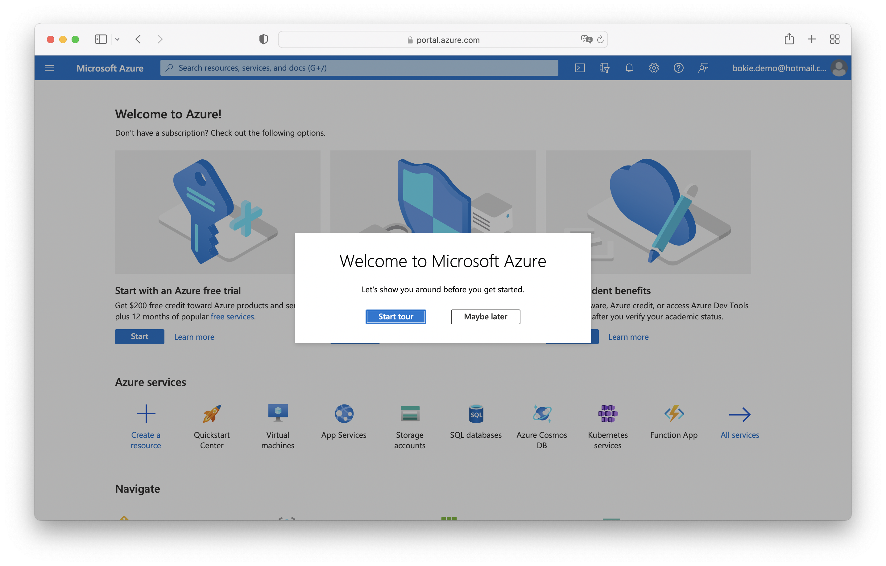
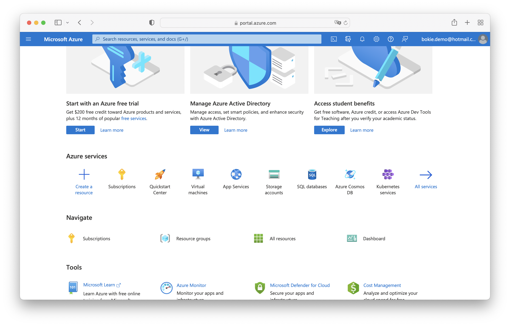
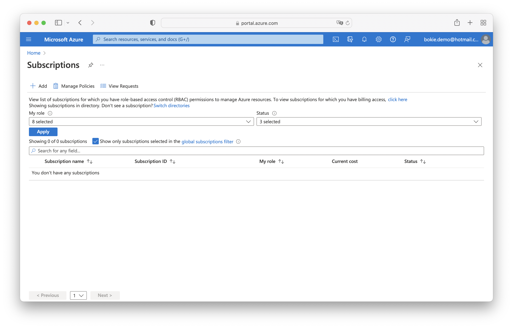
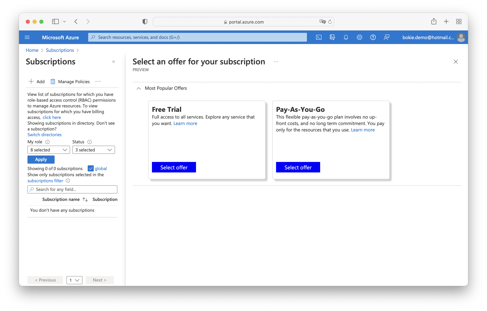
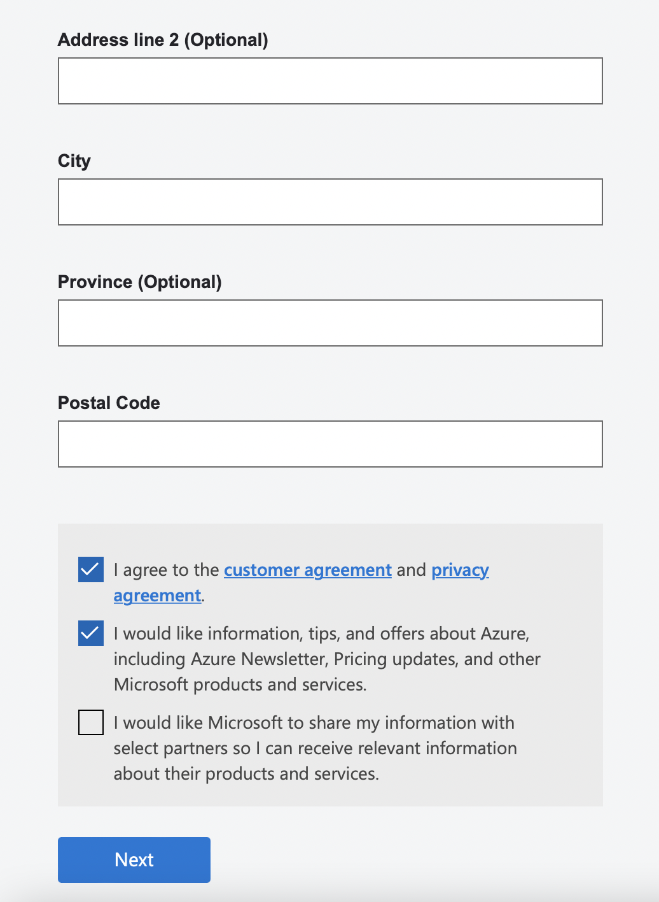
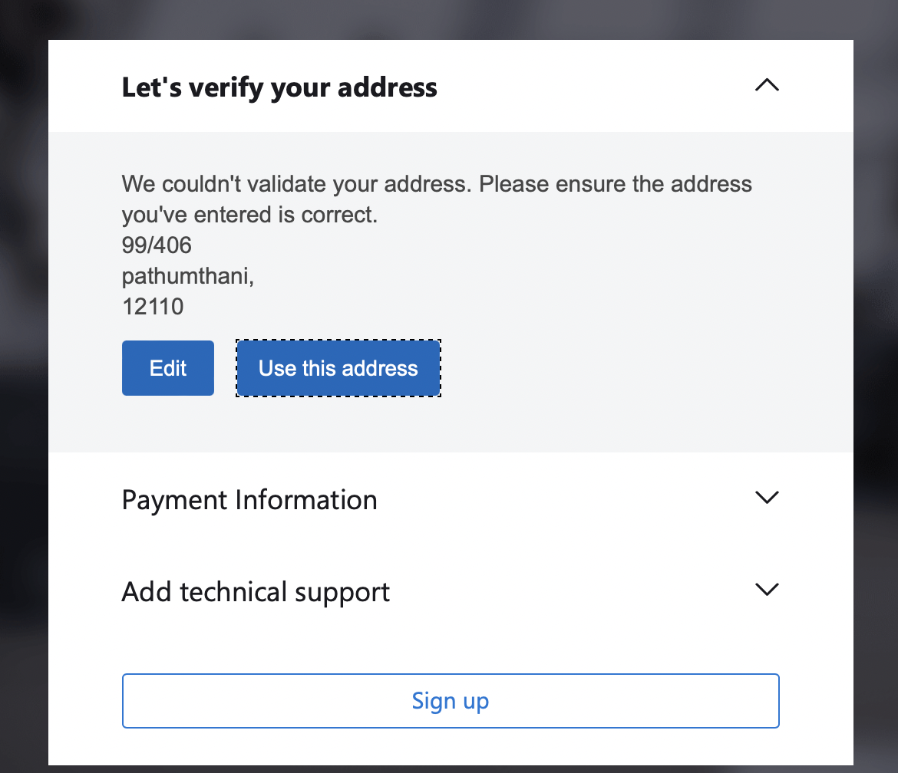
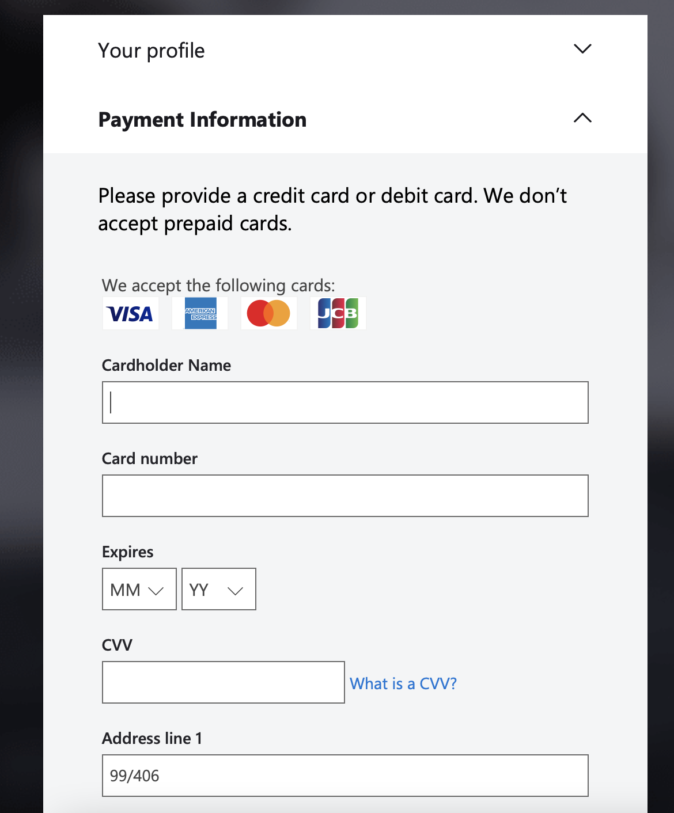

# Create Subscription

Create account 

Overview poral Azure in subscriptions

List of Subscriptions then click + Add a new subscription

Select an offer

if you select : on Pay as you Go must be use credit or debit card or other info to payment method.

enter payment info

