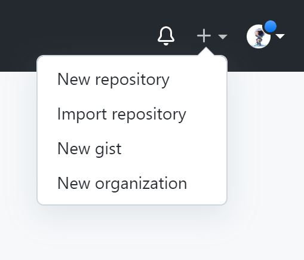
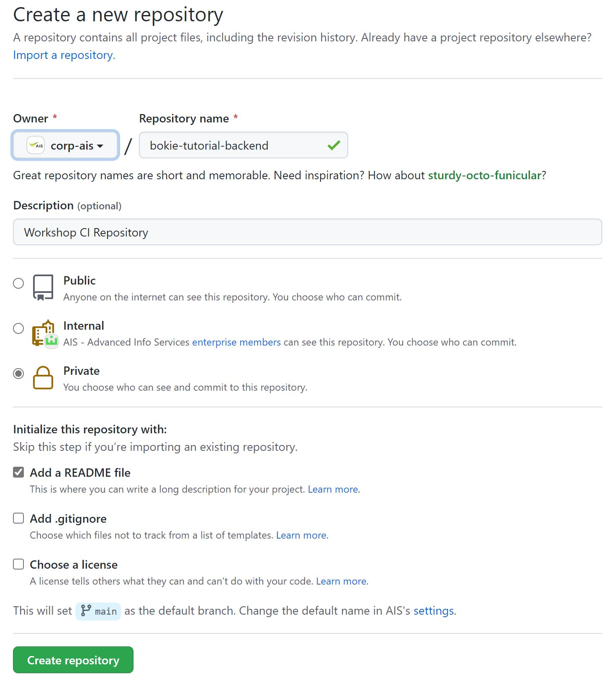
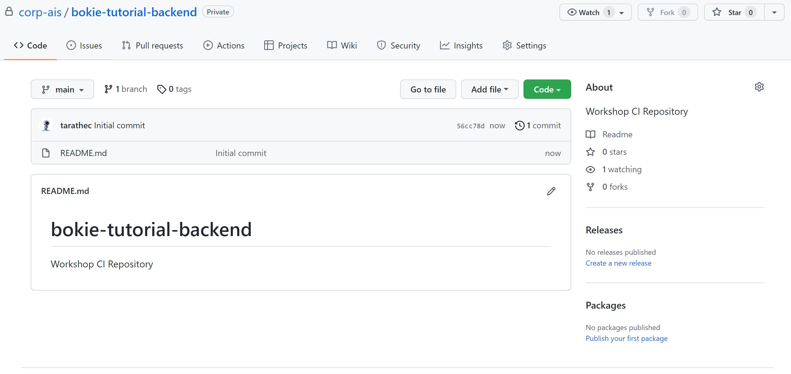

# Create Repository on GitHub (ORGANIZATION)

## Prerequisites

- [GitHub account is already](./github-register.md)
- [2Factor Authenication]()

## Create Reposotory

go to top right then click button + => New repository

Create a new repository page
- select Owner :
  - personal repository
  - oganization repository (selected)
- enter Repository name : [name]-tutoral-backend
- Description : explain to repository
- Type of repos
  - Public
  - Private (selected)
  - Internal
- Intitalize repo
  - Add a README.md (recommand to checked)
  - Add .gitignore (when you know project such as nodejs ignore node_module)
- Create repository

Overview Repository

