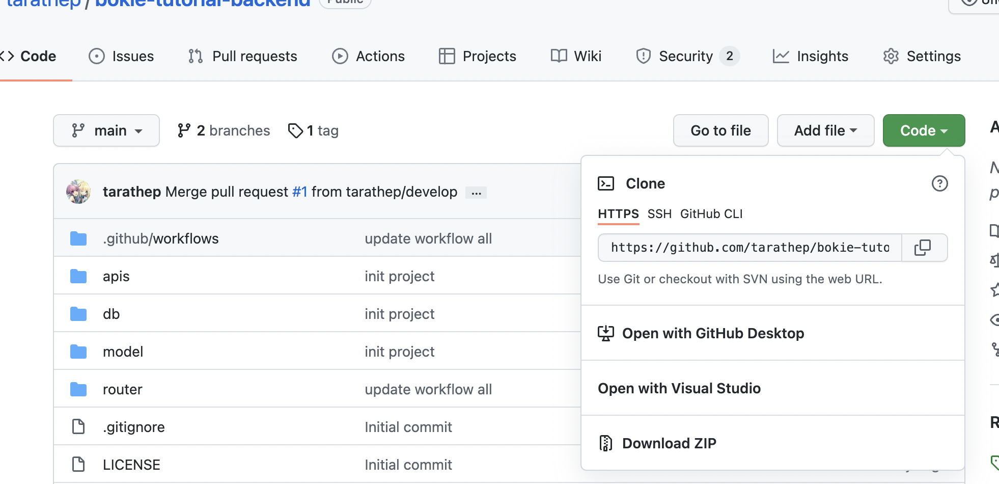

# Git Command

## Prerequisites

- [Setup Git](https://git-scm.com)
- [Register Remote Git (GitHub)](./github-register.md)
- [Create Repository on GitHub](./create-repository.md)

## Init project Git local

create project
```bash
mkdir project-name

cd project-name
```

```bash
git init
```


## Init Project via Clone Repository

- HTTPS
```bash
git clone https://github.com/tarathep/bokie-tutorial-backend.git
```
- SSH
  - [Set Key pair](https://docs.github.com/en/authentication/connecting-to-github-with-ssh/generating-a-new-ssh-key-and-adding-it-to-the-ssh-agent)
  
  - [Generate Keypair](https://docs.github.com/en/authentication/connecting-to-github-with-ssh/generating-a-new-ssh-key-and-adding-it-to-the-ssh-agent)
  
```bash
git clone git@github.com:tarathep/bokie-tutorial-backend.git
```
- [GitHub CLI](https://cli.github.com/)
  




## Cheat Cheet Command

https://education.github.com/git-cheat-sheet-education.pdf
