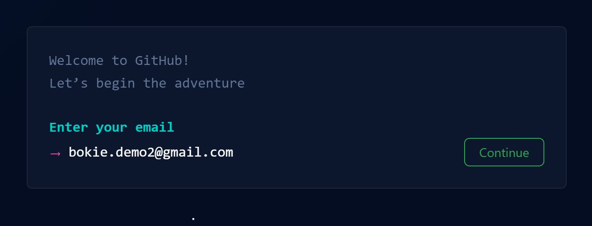
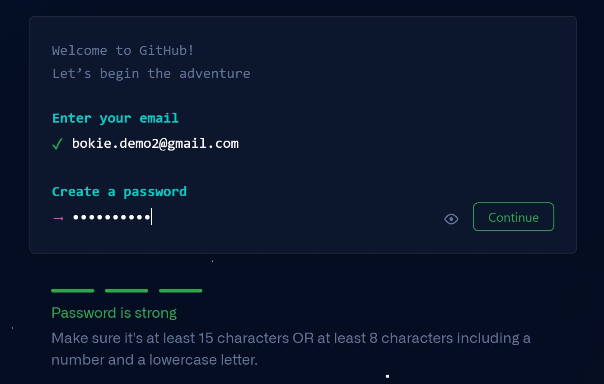
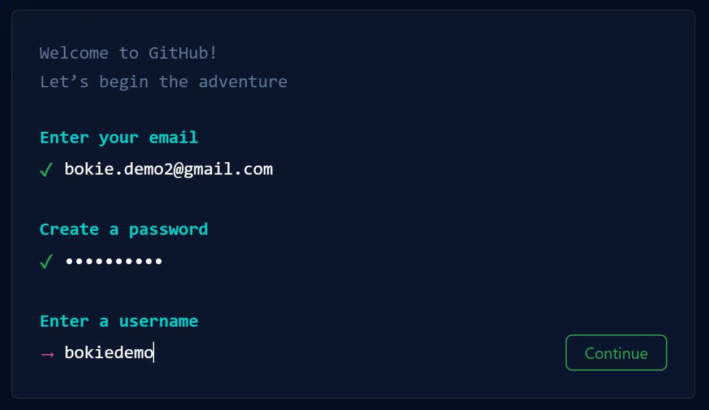
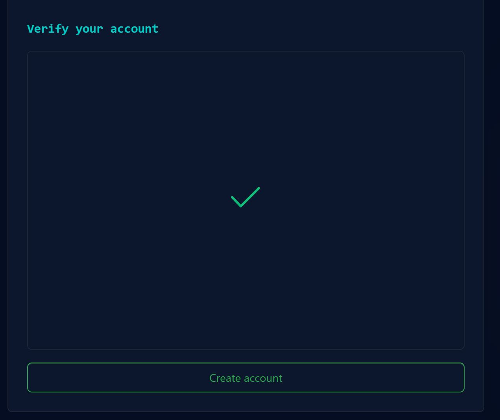
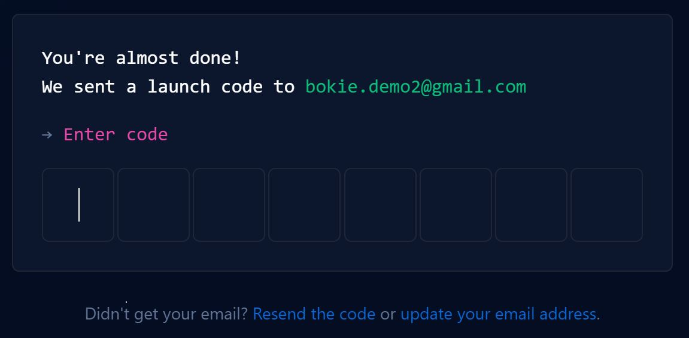
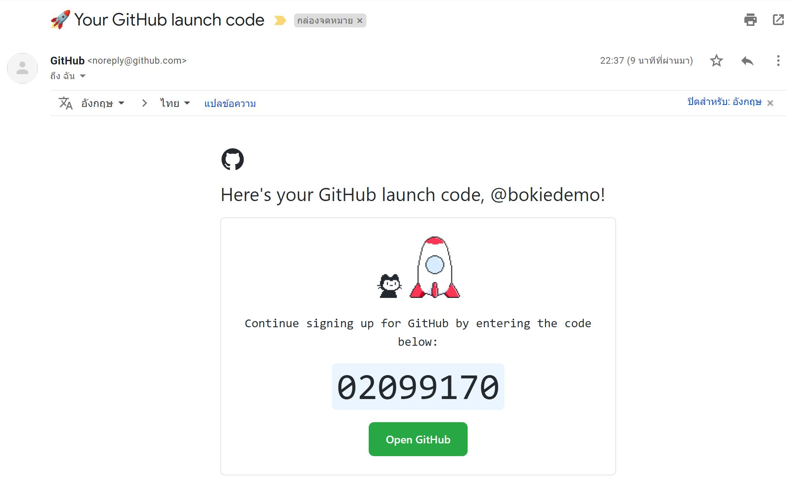
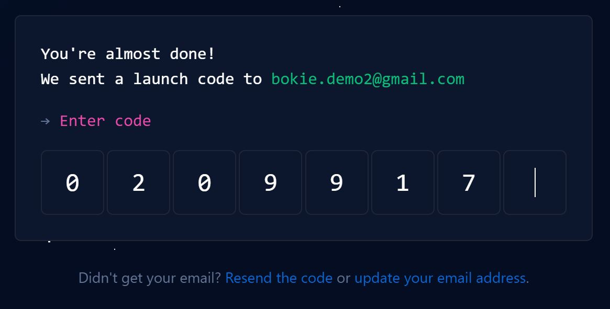
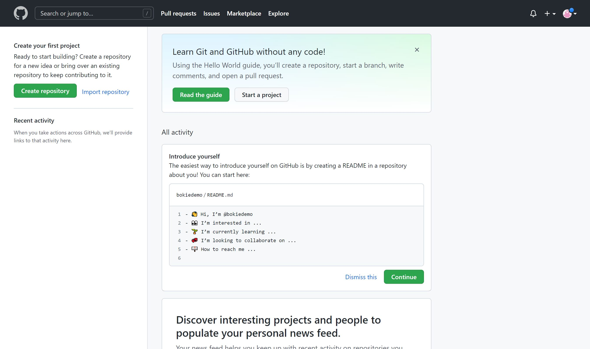

# Register GitHub Account (Personal account)

  go to https://github.com then click **Sign up** button

- Enter your email

- Create a password in the below  has  message for recomannd security lv

- Enter a username is unique
  

- Would you like to receive ..

- Verify you account by select image and then click Create account
  

- check the email box and enter code to verify email
  

- in mailbox reclived email from github

- copy code and paste into the box

- Welcome to GitHub page then below select **Skip Personalization**

- Success to registerd

