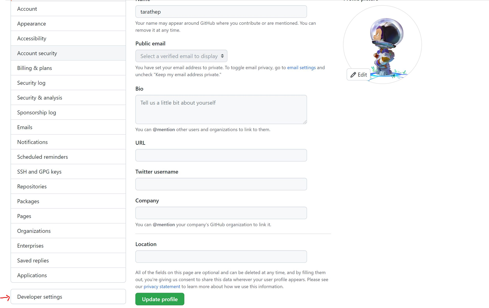
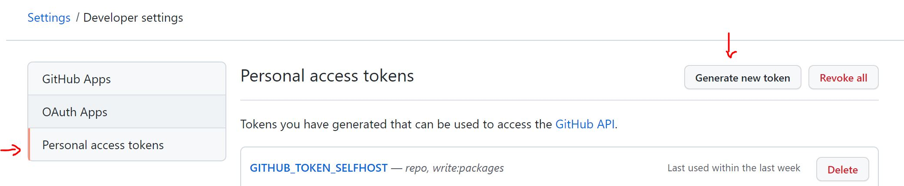
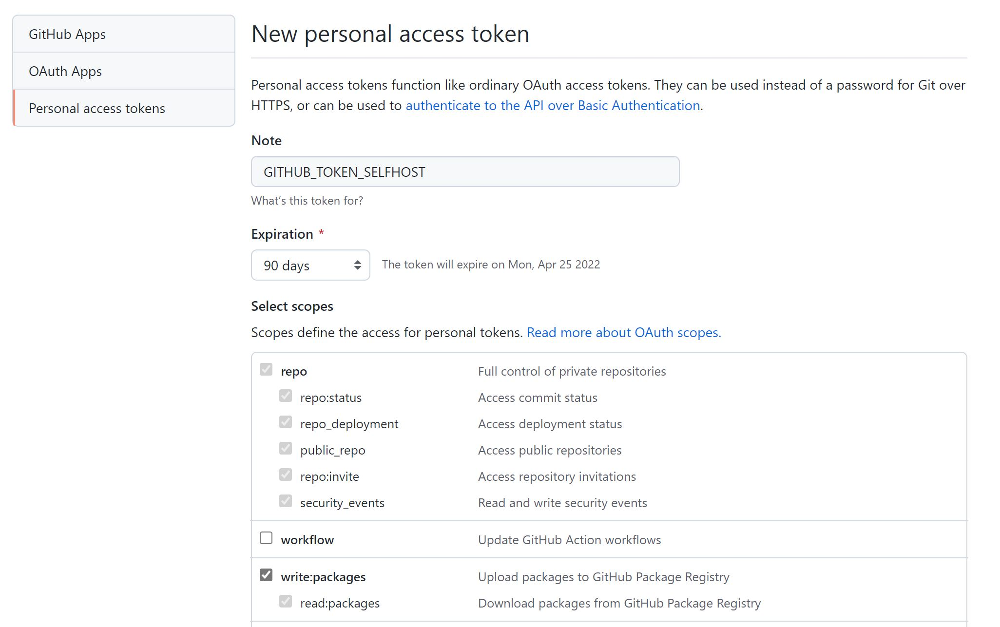
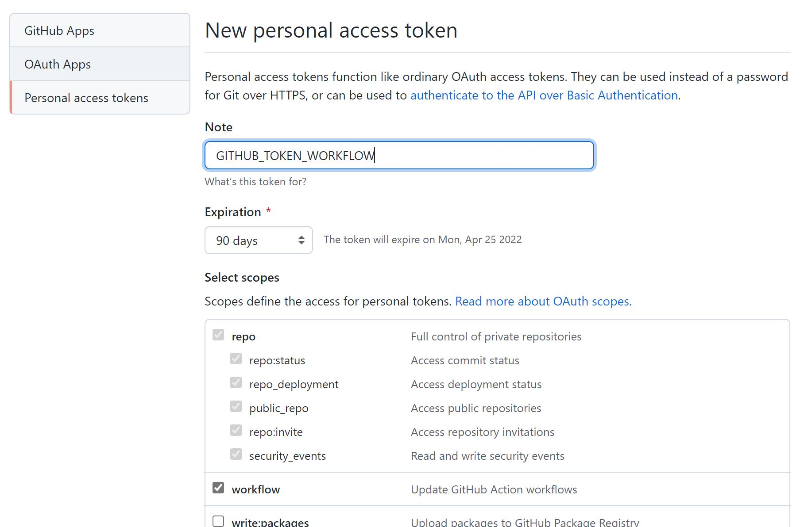

# Personal Access Token

- Go to Profile on top right side
- Click on Profile

- Select Settings

- Developer settings
  

- Personal access tokens

- New personal access token
  - Note of Name Token
  - Expriation : mustbe recommand 90 day
  - for level access on selfhost
    - repo
    - write:package

  
  - for level of access workflows
    - repo
    - workflow

then generate new token and make sure copied before close it (token will be shown this once!!)

